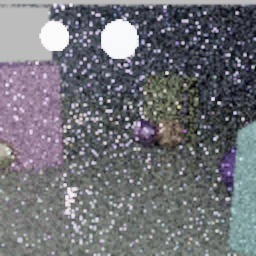
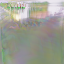
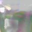
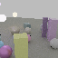

# ommatidia

[](https://github.com/kvark/ommatidia/actions/workflows/check.yml)

Portable neural reconstruction from sparse path samples. Rust,
[Meganeura](https://github.com/kvark/meganeura), Vulkan and Metal.

**Research prototype—not a demonstrated DLSS replacement.** The active model
reconstructs diffuse illumination and specular radiance separately, selects
among multiscale and reprojected candidates, and preserves known surface albedo
and emission. Training includes confidence supervision and short radiance BPTT.
The published v0.3.1 checkpoint remains supported by the legacy runtime.

## Visual results

Historical spatial denoising, local-light scene, 2x reconstruction. These are
archived outputs, **not** the new transport/field model. [Full comparison and
limitations](docs/results-overview.md).

| Sparse paths + bilinear | Historical Ommatidium | 4,096-spp reference |
|---|---|---|
|  |  |  |

## Build

Place `ommatidia` and `meganeura` in sibling directories. CI pins Meganeura
`3d424e0` ([checkpoint fix](https://github.com/kvark/meganeura/pull/160));
Blade 0.9 and Naga 30 come from crates.io and Cargo.lock. The data generator
reads Blade's WGSL from `../blade/blade-render/code` (or `--shader-dir`);
CI uses the matching `c24621a` source checkout for shaders and fixtures.

```sh
cargo +1.92.0 test --workspace --locked
cargo +1.92.0 run -p ommatidia-train --bin transport -- --help
bash benchmarks/transport-lavapipe.sh
```

## Offline field experiment

Posed RGB only; no G-buffer or velocity. The wider variant shares the image
pyramid and predicts a density/radiance field. Synthetic light and surface labels
enter only training losses. See [field.md](docs/field.md),
[surface supervision](docs/surface.md), and [late source-view fusion](docs/late-fusion.md).

```sh
cargo +1.92.0 run -p ommatidia-train --bin field -- --help
FIELD_UPDATES=2048 bash benchmarks/surface-lavapipe.sh
```

One construction scene, separate validation camera, **64x64 native pixels
enlarged**, 2048 updates. Surface supervision improves geometry and colour, but
both fields remain blurry. [Protocol, metrics and limitations](docs/results/surface-lavapipe-2026-09-07.md).

| RGB/source supervision | + surface termination | Reference |
|---|---|---|
|  |  |  |

## Quality and integration

See [the architecture and input contract](docs/design.md),
[the quality harness](benchmarks/README.md), and
[the quality roadmap](docs/quality-roadmap.md).
`ommatidia::transport::native::Native` exposes the new Rust GPU path;
`process` adds synchronous upload/readback for tests. Existing `Upscaler`/C ABI
clients retain legacy checkpoint behavior.

[Published weights](https://huggingface.co/mad-bot/ommatidia) ·
[Historical datasets](https://huggingface.co/datasets/mad-bot/ommatidia) ·
[Historical results](docs/results-overview.md)

Old captures may have mismatched path depth or camera-motion history. The new
trainer requires matched transport provenance and disjoint scene/family splits;
do not relabel old data or edit old checkpoint sidecars into the new model.
Historical training commands require their recorded Git revisions.
