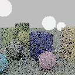
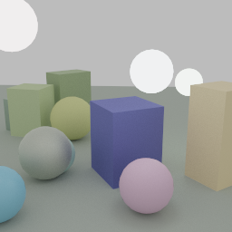
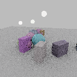
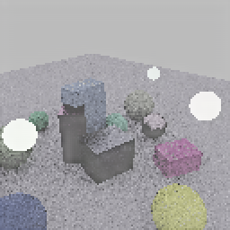
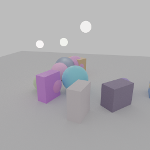
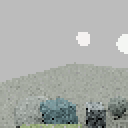
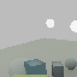
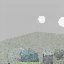
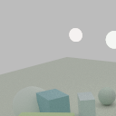

# ommatidia

Neural frame reconstruction from sparse samples — a portable DLSS replacement.

The network runs through [meganeura](https://github.com/kvark/meganeura) on
Vulkan and Metal, so there is no CUDA, no vendor SDK, and no Python anywhere in
the pipeline. Training data comes from [blade](https://github.com/kvark/blade):
a sparse low-resolution path trace provides the primary input and a converged
high-resolution path trace provides ground truth. Raw ReSTIR and ReSTIR+SVGF
remain comparison baselines; the product does not assume either one upstream.

> **Status:** early. The published v0.1 checkpoint is the first single-frame
> Blade integration and was trained on raw ReSTIR. The generator on `main` is
> path-tracing-first for the next checkpoint. Temporal history is designed but
> not implemented; see [`docs/temporal.md`](docs/temporal.md).


[Download the checkpoint](https://huggingface.co/mad-bot/ommatidia) ·
[Training and validation data](https://huggingface.co/datasets/mad-bot/ommatidia)

The v0.1 replacement checkpoint is trained on 2,400 raw-ReSTIR/canonical
pairs, with 360 scenes held out. It improves over raw nearest upsampling by
**2.93 dB**. On a separate matched validation set whose canonical references
are byte-identical between both captures, it scores **0.002876** error against
Blade SVGF's **0.004284** after nearest upscale: a **1.73 dB improvement over
the variance-guided denoiser it replaces**. On an idle Radeon RX 7900 XT, the
649k-parameter network backbone measures **20.13 ms for an actual
960×540 → 1920×1080 2× reconstruction**, about 50 frames per second before
texture packing, unpacking, and display post-processing. This is measured
model time, not a claim that the full renderer runs at 20 ms.

Upscaling is real today, but narrowly scoped: the published checkpoint and the
current training recipe are **2×**. Runtime frames may be rectangular (the
measured path is 960×540 to 1920×1080), while training uses square crops. There
is no trained 1× denoise-only model, dynamic quality mode, or temporal
supersampling yet; changing the scale means training a checkpoint whose output
head has the corresponding `3 × scale²` channels.

## Results

The path-tracing-first data path now produces an unbiased one-path input and a
4,096-spp reference. This pair is the target for the next checkpoint; it does
not run the v0.1 ReSTIR-trained weights on an out-of-distribution input.

| Sparse path trace (1 spp, 128×128) | Converged target (4,096 spp, 256×256) |
|---|---|
|  |  |

The v0.1 live shared-context path, from Blade's raw ReSTIR output to the
canonical reference:

| Raw ReSTIR input (128×128) | Ommatidium (2×, 256×256) | Canonical path trace (256×256) |
|---|---|---|
|  |  |  |

This image also exposes why ReSTIR is not the primary product input: its
real-time mode estimates direct illumination, so surfaces occluded from the
environment can be nearly black while multi-bounce canonical paths contain
indirect light. Blade's stale-target reservoir reuse has been corrected, but
missing indirect transport is an estimator limitation, not something an
ambient term should hide.

The matched historical validation capture below uses the same scene and byte-identical
canonical reference for both Blade inputs. Images are nearest-upscaled for a
like-for-like 2×, 256×256 comparison.

| Raw ReSTIR | Blade SVGF | Ommatidium | Canonical reference |
|---|---|---|---|
|  |  |  |  |

The checked-in July experiments below used SVGF-filtered inputs. They found the
architecture and kernel optimizations, but their quality figures describe an
upscaler stacked after SVGF, not its replacement. Dataset v2 records that
provenance and the trainer refuses filtered data unless
`--allow-filtered-input` is explicit. Findings worth knowing before reading
further:

- **The direct objective beats the diffusion one**, by 5.12 dB against 1.54,
  with the diffusion arm given half again as much training. Worse for
  diffusion, its sampler makes its own output worse the more it is used —
  +3.31 dB at one step, +1.55 at twenty. Conditioning on the renderer's
  G-buffer leaves little for a sampler to explore, so iterating only
  accumulates the model's own error.
- **The G-buffer is worth half a decibel** over colour alone, steadily, for
  channels the renderer produced anyway.
- **The deployment shape is semi-realtime, but not a 2 ms upscaler.** Two kernel fixes
  in meganeura — parallelising GroupNorm over the image, and making the
  Winograd transforms read contiguously — were worth 5.4x with the weights
  untouched. The rest was not needing the large network at all: a 649k
  parameter model matches the 6.5M one once it is trained out. It now reaches
  roughly 50 fps at 960×540 → 1920×1080; see the latency section of the design doc for the
  work required to reach a dedicated-upscaler budget.
- **Compare shapes at convergence, not at a fixed step count.** A sweep that
  gave every shape 5000 steps ranked them almost exactly wrong, because the
  large ones were the undertrained ones.

## Layout

| crate | what it does |
|---|---|
| `ommatidia` | the model, the dataset format, the diffusion schedule, and the host-facing `Upscaler` |
| `ommatidia-data` | renders training pairs with blade |
| `ommatidia-train` | trains a checkpoint and evaluates it |

Both siblings are path dependencies, so a checkout expects `../blade` and
`../meganeura` beside it. The workspace `[patch]` section forces meganeura's
`blade-graphics` and blade's own to resolve to the same crate — without that,
the `Context` a host renderer owns is not the type meganeura's session accepts.

## Try it

```sh
# Render a training set. Pick the adapter explicitly if there are several.
cargo run --release -p ommatidia-data -- \
    --device-id 0x744c --out data/train.omd \
    --samples 2400 --lr 128x128 --scale 2 \
    --input-frames 1 --canonical-frames 1024

# Train, then reconstruct a crop and write input/nearest/predicted/reference PNGs.
cargo run --release -p ommatidia-train -- \
    --device-id 0x744c --data data/train.omd --steps 8000 \
    --lr 3e-4 --lr-final 1e-5 --eval-every 1000 --checkpoint-every 1000 \
    --out runs/first --eval-out runs/first-eval
```

Direct regression in one forward pass is the default and the main line;
`--objective diffusion` shares the same backbone and is kept for comparison,
not because it wins — see the status note above. A checkpoint of either loads
into the same runtime, and `--eval-only` re-scores a finished one without
retraining it, which is how the sampler-step sweep above was measured.

The generator defaults to one sparse path per input pixel and 4,096 paths per
reference pixel. `--restir-input` and `--svgf-input` exist only for matched
Blade baselines; SVGF datasets are tagged and need the trainer's explicit
`--allow-filtered-input` override.

Passing `--checkpoint runs/first --preview runs/live` to the generator also
runs that checkpoint from the live `RayTracer` texture views and writes
`*-predicted.png`, exercising the same shared-context path as a host renderer.

Each sample stores the colour alongside the renderer's own depth, normals,
albedo, specular reflectance, and roughness. That is the structural advantage a
renderer has over photographic super-resolution — it knows where the
silhouettes are rather than having to infer them — and at input resolution it
costs nothing, since the renderer filled those targets on its way to shading.
The trainer takes the plane set from the file header, so `--color-only` gives
the other arm of that ablation without regenerating anything.

## Using it from Blade

Render at the model's input resolution, then hand Ommatidium the input textures
and the graphics context the application already owns. The v0.1 convenience
example below uses Blade's raw ReSTIR views because that is what its published
weights were trained on; new path-traced checkpoints use
`FrameInputs::from_color_and_blade_gbuffer`.
The network executes on the same device and queue — no second context, external
memory import, cross-device copy, or direct-model CPU readback.

```rust
renderer.render(
    &mut encoder,
    blade_render::RenderMode::RealTime,
    debug_config,
    ray_config,
    None, // Ommatidium replaces SVGF.
);

let low = renderer.get_surface_size();
let mut upscaler = ommatidia::Upscaler::from_checkpoint_for_extent(
    context.clone(),
    "runs/first",
    [low.width, low.height],
    /* sampler steps = */ 1,
    /* timesteps = */ 1000,
)?;

upscaler.upscale(
    &mut encoder,
    &ommatidia::FrameInputs::from_blade(&renderer),
    output_view, // Rgba16Float, at upscaler.output_extent()
);

// Record display after the unpack dispatch. Blade applies its normal tone
// mapper to the neural result instead of its internal radiance.
renderer.post_proc_external(
    &mut display_pass,
    output_view,
    debug_config,
    post_proc_config,
    &[],
    &[],
);
```

Raw Vulkan/C integration is planned as a user-space C ABI, not a Vulkan
extension. The ownership, synchronization, and release contract is in
[`docs/integration.md`](docs/integration.md).

Note the sampler still walks the chain on the host, one roundtrip per step, so
a diffusion checkpoint is far from a frame budget. A direct one is a single
forward pass, which is the other reason it is the main line.

## A long run

`scripts/curriculum.sh` drives one unattended, serialising its runs so they do
not contend, and waiting rather than failing if the device is short of memory.
`scripts/curve.py` lines the resulting runs up by step. Calibrate the step rate
first: it is set by whatever else is using the GPU rather than by model size,
and the cosine schedule needs the total step count up front.

## Tests

```sh
cargo test                                  # everything that needs no GPU
cargo test -- --ignored                     # the GPU tests
```

The GPU tests are worth knowing about: `gpu_runtime` checks that the pack and
unpack shaders reproduce the CPU batching value for value and SSIM-checks a
deterministic non-zero-network PNG on LavaPipe. That is the one
contract in the system that fails silently — the network trains against the CPU
path, so if the shaders drift, training keeps looking perfect and the renderer
produces garbage.
