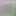
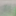
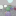

# ommatidia

[](https://github.com/kvark/ommatidia/actions/workflows/check.yml)

Portable neural reconstruction from sparse path samples. Rust,
[Meganeura](https://github.com/kvark/meganeura), Vulkan and Metal.

**Research prototype—not a demonstrated DLSS replacement.** The active model
reconstructs diffuse illumination and specular radiance separately, selects
among multiscale and reprojected candidates, and preserves known surface albedo
and emission. Training includes confidence supervision and short radiance BPTT.
The published v0.3.1 checkpoint remains supported by the legacy runtime.

## Visual results

Historical spatial denoising, local-light scene, 2x reconstruction. These are
archived outputs, **not** the new transport/field model. [Full comparison and
limitations](docs/results-overview.md).

| Sparse paths + bilinear | Historical Ommatidium | 4,096-spp reference |
|---|---|---|
|  |  |  |

## Build

Place `ommatidia` and `meganeura` in sibling directories. CI pins Meganeura
`d903bba`; Blade 0.9 and Naga 30 come from crates.io and Cargo.lock. The data
generator additionally reads Blade's WGSL from `../blade/blade-render/code`
(or `--shader-dir`); CI uses the matching `c24621a` source checkout.

```sh
cargo +1.92.0 test --workspace --locked
cargo +1.92.0 run -p ommatidia-train --bin transport -- --help
bash benchmarks/transport-lavapipe.sh
```

## Offline field experiment

Posed RGB only; no G-buffer or velocity. The wider variant shares the image
pyramid, predicts a density/radiance field, and receives synthetic light labels
only through training losses. See [field.md](docs/field.md).

```sh
cargo +1.92.0 run -p ommatidia-train --bin field -- --help
bash benchmarks/field-lavapipe.sh
```

The current field is still blurry. Below: one fixed held case (scene 10000,
optimization seed 7), **16x16 native pixels enlarged**, 128 updates. Incident loss
is not promoted; see [all four paired results](docs/results/incident-lavapipe-2026-09-07.md).

| RGB/source supervision | + incident supervision | Reference |
|---|---|---|
|  |  |  |

## Quality and integration

See [the architecture and input contract](docs/design.md),
[the quality harness](benchmarks/README.md), and
[the quality roadmap](docs/quality-roadmap.md).
`ommatidia::transport::native::Native` exposes the new Rust GPU path;
`process` adds synchronous upload/readback for tests. Existing `Upscaler`/C ABI
clients retain legacy checkpoint behavior.

[Published weights](https://huggingface.co/mad-bot/ommatidia) ·
[Historical datasets](https://huggingface.co/datasets/mad-bot/ommatidia) ·
[Historical results](docs/results-overview.md)

Old captures may have mismatched path depth or camera-motion history. The new
trainer requires matched transport provenance and disjoint scene/family splits;
do not relabel old data or edit old checkpoint sidecars into the new model.
Historical training commands require their recorded Git revisions.
