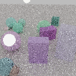
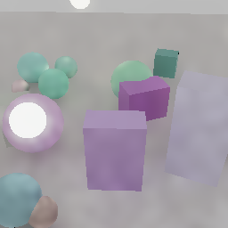
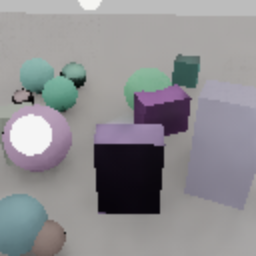
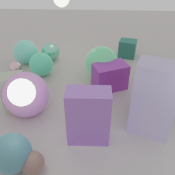

# ommatidia

[](https://github.com/kvark/ommatidia/actions/workflows/check.yml)

Neural frame reconstruction from sparse samples — a portable DLSS replacement.

The network runs through [meganeura](https://github.com/kvark/meganeura) on
Vulkan and Metal, so there is no CUDA, no vendor SDK, and no Python anywhere in
the pipeline. Training data comes from [blade](https://github.com/kvark/blade):
a sparse low-resolution path trace provides the primary input and a converged
high-resolution path trace provides ground truth. ReSTIR+SVGF is a comparison
control only; the product does not assume sample reuse or a prior denoiser.

> **Status:** early. The current v0.3.1 checkpoint is trained from independent
> sparse paths, uses no sample reuse, and accepts output-resolution primary
> surfaces for sharper silhouettes. The v0.1 raw-ReSTIR checkpoint remains as
> historical provenance. Temporal history is designed but not yet implemented;
> see [`docs/temporal.md`](docs/temporal.md).


The transformer investigation and the resulting complexity/temporal decision are
documented in [`docs/architecture-decision.md`](docs/architecture-decision.md).

[Download the checkpoint](https://huggingface.co/mad-bot/ommatidia) ·
[Training and validation data](https://huggingface.co/datasets/mad-bot/ommatidia)

The Hugging Face `v0.3.1` revision contains the tuned HR-guided b8 checkpoint used
below; `v0.2.0` retains the low-resolution-only checkpoint. Repeated
960×540 → 1920×1080 runs on a Radeon RX 7900 XT span 8.46–9.30 ms median;
the v0.3.1 trace measured 8.83 ms median and 8.90 ms p90, including pack,
model, unpack, and submissions. Its isolated split was 0.79 ms pack, 7.22 ms
network, and 0.88 ms unpack. Ray tracing,
the optional output-resolution primary-surface pass, and display
post-processing are excluded. The range is reported because amdgpu's load
counter became intermittently unavailable during the final trace; the harness
now reports that condition rather than silently calling the device idle.

Upscaling is real today, but narrowly scoped: the published checkpoint and the
current training recipe are **2×**. Runtime frames may be rectangular (the
measured path is 960×540 to 1920×1080), while training uses square crops. There
is no trained 1× denoise-only model, dynamic quality mode, or temporal
supersampling yet; changing the scale means training a checkpoint whose output
head has the corresponding `3 × scale²` channels.

## Results

The path-tracing-first data path produces independent sparse paths and a
4,096-spp reference. It does not run historical weights on an
out-of-distribution input.

On 128 non-overlapping crops from a separate seed-10000 validation set,
texel-aligned bilinear scores 26.51 dB / 0.5776 SSIM. The v0.3 filter reaches
34.61 dB / 0.9543 before its learned correction. A held-out sweep tuned the
same fixed-cost filter to 34.72 dB / 0.9574; the matching b8 residual reaches
34.74 dB / 0.9575. The
network still runs wholly at low resolution; the extra guide is contained in
Ommatidium's existing unpack dispatch, with no ReSTIR or SVGF upstream and no
new Meganeura graph operation or shader group. Filter coefficients are stored
in the checkpoint, so the runtime continues to interpret v0.3.0 exactly as it
was trained while v0.3.1 opts into the tuned profile.
A matched 1-spp arm reaches 31.74 dB / 0.9215 SSIM with the HR guide, but a b8
network trained specifically on that distribution adds less than 0.005 dB.
That closes the “larger static network” branch: temporal history must supply
new samples before more model capacity is justified.
On the current common 128-crop score, a perfect static-history oracle makes
that value concrete: the tuned guide rises from 32.17 dB at one accumulated
sample to 33.76 at two, 34.72 at four, 35.50 at eight, and 35.89 at sixteen.
Four aligned 1-spp frames are worth +2.55 dB before motion and rejection
losses—over one hundred times the b8 static residual's gain.
The first moving-camera oracle then measures the important failure mode:
motion-only accumulation ghosts and falls from 31.17 to 29.09 dB, whereas
depth/normal/albedo rejection reaches 32.33 dB / 0.9301 SSIM. Only 2.7% of
history pixels are rejected. Validity is therefore an explicit input to the
next temporal model, not something a larger backbone should have to infer.
The sequence-aware trainer now preserves whole-sequence splits and tests a
safe temporal model: accumulated colour remains the deterministic base, while
current RGB, confidence, and the exact guided base are ordinary U-Net input
channels. Predicting three low-resolution colour corrections reaches 32.28 dB
on a separate moving-sequence set versus 32.26 dB for rejected history alone;
a 4×-compute b16 control reaches 32.30 dB. The small learned increment is real
but not release-worthy, so the spatial v0.3.1 runtime remains the default while
motion diversity and temporal losses are expanded. See the
[`temporal model result`](docs/results/temporal-low-color-2026-08-14.md).
The complete controlled setup and trace are recorded in the
[`independent-path result`](docs/results/path-trace-guided-2026-08-13.md).

A compute-matched shifted-window transformer tied the convolutional network in
quality and ran 7.5% slower. Its experimental Meganeura window primitive was
removed again, deleting roughly 440 lines rather than carrying unused graph,
autodiff, compiler, and shader surface. The evidence and future temporal gate
are in the [`architecture decision`](docs/architecture-decision.md).

The primary comparison is now ordered by the actual product path. Every image
is a matched 2× reconstruction of the same held-out scene; ReSTIR+SVGF is a
separate control, not Ommatidium's input.

| Sparse paths (4 spp, 128×128) | Bilinear 2× | Ommatidium HR-guided 2× | ReSTIR+SVGF control, bilinear 2× | Canonical (4,096 spp, 256×256) |
|---|---|---|---|---|
|  |  |  |  |  |

### Why the ReSTIR control is darker

Blade's linear-HDR regression shows that no-reuse ReSTIR carries 99.1% and
pairwise reuse 99.0% of a **transport-matched direct** canonical reference.
The remaining dark faces are not a reservoir normalization loss: Blade's
real-time mode stops at the first non-emissive hit, while the clean canonical
target traces secondary paths that bring indirect fill back from the floor and
neighboring objects. NVIDIA likewise treats multi-bounce reuse as a separate
[ReSTIR GI](https://research.nvidia.com/publication/2021-06_restir-gi-path-resampling-real-time-path-tracing)
algorithm. The table above therefore labels ReSTIR+SVGF as a direct-light
comparison control and never presents raw ReSTIR as Ommatidium source data.

The checked-in July experiments below used SVGF-filtered inputs. They found the
architecture and kernel optimizations, but their quality figures describe an
upscaler stacked after SVGF, not its replacement. Dataset v2 records that
provenance and the trainer refuses filtered data unless
`--allow-filtered-input` is explicit. Findings worth knowing before reading
further:

- **The direct objective beats the diffusion one**, by 5.12 dB against 1.54,
  with the diffusion arm given half again as much training. Worse for
  diffusion, its sampler makes its own output worse the more it is used —
  +3.31 dB at one step, +1.55 at twenty. Conditioning on the renderer's
  G-buffer leaves little for a sampler to explore, so iterating only
  accumulates the model's own error.
- **The G-buffer is worth half a decibel** over colour alone, steadily, for
  channels the renderer produced anyway.
- **The deployment shape is semi-realtime, but not a 2 ms upscaler.** Two kernel fixes
  in meganeura — parallelising GroupNorm over the image, and making the
  Winograd transforms read contiguously — were worth 5.4x with the weights
  untouched. The rest was not needing the large network at all: a 649k
  parameter model matches the 6.5M one once it is trained out. With the much
  stronger low-resolution guided base, a 74k-parameter b8 model stays within
  0.03 dB of b24 and runs in 7.76 ms end to end at 960×540 → 1920×1080. The
  sharper v0.3 HR-guided path adds roughly one millisecond in unpack.
- **Compare shapes at convergence, not at a fixed step count.** A sweep that
  gave every shape 5000 steps ranked them almost exactly wrong, because the
  large ones were the undertrained ones.

## Layout

| crate | what it does |
|---|---|
| `ommatidia` | the model, the dataset format, the diffusion schedule, and the host-facing `Upscaler` |
| `ommatidia-capi` | versioned C ABI; checkpoint discovery today, borrowed-Vulkan inference in progress |
| `ommatidia-data` | renders training pairs with blade |
| `ommatidia-train` | trains a checkpoint and evaluates it |

Both siblings are path dependencies, so a checkout expects `../blade` and
`../meganeura` beside it. The workspace `[patch]` section forces meganeura's
`blade-graphics` and blade's own to resolve to the same crate — without that,
the `Context` a host renderer owns is not the type meganeura's session accepts.

## Try it

```sh
# Render a training set. Pick the adapter explicitly if there are several.
cargo run --release -p ommatidia-data -- \
    --device-id 0x744c --out data/train.omd \
    --samples 2400 --lr 128x128 --scale 2 \
    --input-frames 4 --canonical-frames 1024 --hr-gbuffer

# Train, then reconstruct a crop and write input/nearest/predicted/reference PNGs.
cargo run --release -p ommatidia-train -- \
    --device-id 0x744c --data data/train.omd --steps 8000 \
    --lr 3e-4 --lr-final 1e-5 --eval-every 1000 --checkpoint-every 1000 \
    --out runs/first --eval-out runs/first-eval
```

Direct regression in one forward pass is the default and the main line;
`--objective diffusion` shares the same backbone and is kept for comparison,
not because it wins — see the status note above. A checkpoint of either loads
into the same runtime, and `--eval-only` re-scores a finished one without
retraining it, which is how the sampler-step sweep above was measured.

The generator defaults to one three-bounce sparse path per input pixel and
4,096 eight-bounce paths per reference pixel (with Russian roulette after the
fourth bounce). `--restir-input` and `--svgf-input` exist only for matched Blade
baselines; SVGF datasets are tagged and need the trainer's explicit
`--allow-filtered-input` override.

Passing `--checkpoint runs/first --preview runs/live` to the generator also
runs that checkpoint from the live `RayTracer` texture views and writes
`*-predicted.png`, exercising the same shared-context path as a host renderer.
For input-sample-count or estimator ablations, `--reference-from existing.omd`
copies the already-rendered high-resolution records. It verifies every copied
sample's G-buffer against the newly rendered scene and camera, so a mismatched
seed cannot silently pair unrelated input and ground truth.

Each sample stores the colour alongside the renderer's own depth, normals,
albedo, specular reflectance, and roughness. With `--hr-gbuffer`, it also stores
output-resolution depth, normal, and albedo. That is the structural advantage a
renderer has over photographic super-resolution—it can provide exact
silhouettes rather than ask the upscaler to infer them. Input-resolution planes
come from sparse shading; output-resolution planes may require a separate
primary-surface pass in a pure path tracer.
The trainer takes the plane set from the file header, so `--color-only` gives
the other arm of that ablation without regenerating anything.

## Using it from Blade

Render at the model's input resolution, then hand Ommatidium the input textures
and the graphics context the application already owns. The primary integration
uses the application's independent sparse ray/path colour plus Blade's primary
surface G-buffer. The network executes on the same device and queue—no second
context, external-memory import, cross-device copy, or direct-model CPU
readback.

```rust
path_tracer.render_sparse(&mut encoder, sparse_path_color);
renderer.fill_gbuffer(&mut encoder, debug_config);

let low = renderer.get_surface_size();
let mut upscaler = ommatidia::Upscaler::from_checkpoint_for_extent(
    context.clone(),
    "runs/first",
    [low.width, low.height],
    /* sampler steps = */ 1,
    /* timesteps = */ 1000,
)?;

let inputs = ommatidia::FrameInputs::from_color_and_blade_gbuffer(
    sparse_path_color,
    renderer.view_gbuffer(),
).with_blade_high_resolution_gbuffer(
    high_res_renderer.view_gbuffer(), // after the host's output-resolution primary pass
);

upscaler.upscale(
    &mut encoder,
    &inputs,
    output_view, // Rgba16Float, at upscaler.output_extent()
);

// Record display after the unpack dispatch. Blade applies its normal tone
// mapper to the neural result instead of its internal radiance.
renderer.post_proc_external(
    &mut display_pass,
    output_view,
    debug_config,
    post_proc_config,
    &[],
    &[],
);
```

Raw Vulkan/C integration is planned as a user-space C ABI, not a Vulkan
extension. The ownership, synchronization, and release contract is in
[`docs/integration.md`](docs/integration.md).

The ABI 1.1 checkpoint-inspection slice is available now in
[`include/ommatidia.h`](include/ommatidia.h): it links from plain C and
inspects a checkpoint's exact graph/resource contract without enumerating a
GPU. [`examples/c/inspect.c`](examples/c/inspect.c) is the conformance example.
GPU execution is intentionally not exported yet; adding an entry point that
secretly created a second device would violate the integration contract.

Note the sampler still walks the chain on the host, one roundtrip per step, so
a diffusion checkpoint is far from a frame budget. A direct one is a single
forward pass, which is the other reason it is the main line.

## A long run

`scripts/curriculum.sh` drives one unattended, serialising its runs so they do
not contend, and waiting rather than failing if the device is short of memory.
`scripts/curve.py` lines the resulting runs up by step. Calibrate the step rate
first: it is set by whatever else is using the GPU rather than by model size,
and the cosine schedule needs the total step count up front.

## Tests

```sh
cargo test                                  # everything that needs no GPU
cargo test -- --ignored                     # the GPU tests
```

The GPU tests are worth knowing about: `gpu_runtime` checks that the pack and
unpack shaders reproduce the CPU batching value for value and SSIM-checks a
deterministic non-zero-network PNG on LavaPipe. That is the one
contract in the system that fails silently — the network trains against the CPU
path, so if the shaders drift, training keeps looking perfect and the renderer
produces garbage.
