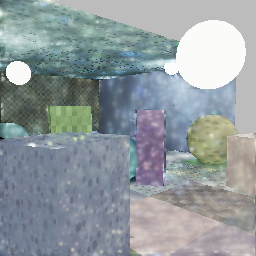
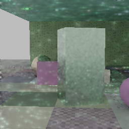

# ommatidia

[](https://github.com/kvark/ommatidia/actions/workflows/check.yml)

Neural reconstruction of sparse path-traced frames, in Rust on
[Meganeura](https://github.com/kvark/meganeura) and
[Blade](https://github.com/kvark/blade).

One model: a **recurrent, lobe-separated radiance-residual U-Net**. It reconstructs
diffuse illumination and specular radiance, then applies observed material albedo
and emission. At 2x scale it has 188,160 parameters. Inputs include 1-spp
low-resolution radiance, motion/jitter and output-resolution primary surfaces.

## Measured results

Fresh, scene/asset-disjoint audit: **128 frames**, 1-spp 128×128 input → 256×256
output, 16-frame causal sequences, 4,096-spp references. One 4,000-update run;
the 3,500-update checkpoint was selected on development PSNR before this audit.

| Audit | PSNR, guide → model ↑ | SSIM, guide → model ↑ | Temporal error ↓ |
|---|---|---|---|
| Procedural scenes | 25.18 → **28.24 dB** | 0.675 → 0.794 | −54% |
| Held-out object scenes | 25.92 → **29.04 dB** | 0.654 → 0.788 | −58% |

The control is the fixed multiscale/recurrent guide, not a historical model.
All 128 frames improve in PSNR in this audit. Mean energy is still 1.0% high
on procedural scenes and 2.3% high on object scenes; specular noise and blotches
remain. [Full metrics, protocol, hashes and limitations](docs/results/README.md).

Sequence 0, frame 7 in each set, chosen before evaluation. Native 256×256
outputs; identical display transform, no retouching.

| Fixed guide | Residual U-Net | Reference |
|---|---|---|
|  |  |  |
|  |  |  |

Object assets: Amazon.com, [ABO / CC BY 4.0](docs/catalog.md). These views are
primitive-dominated; asset-disjoint membership alone is not a visibility audit.

## Build and train

Rust 1.92+. Place `ommatidia`, `blade` and `meganeura` in sibling directories.
Cargo pins Blade to `fbb4f28` and Meganeura to `0dbfcc0`; local sibling checkouts
override those pins. Keep Blade's shader directory at the same revision.

```sh
cargo +1.92.0 test --workspace --locked
cargo build --release --workspace
cargo run --release -p ommatidia-train --bin transport -- \
  --data data/train.omd --eval-data data/dev.omd --out runs/model \
  --steps 4000 --channels 16 --unroll 2 --lr 0.0003 --eval-every 500
```

[Architecture and runtime](docs/design.md) ·
[Data, metrics and reproduction](docs/evaluation.md) ·
[External asset capture](docs/catalog.md)

## Scope

This is a reconstruction research prototype, not demonstrated DLSS parity.
The training corpus is still small and synthetic; game traces, broad interiors,
and matched external-denoiser comparisons remain missing.

The old diffusion, kernel-selector, field/relighting, C ABI, trainers and result
galleries were removed. They remain in Git at `e0922c6`. There are no hidden
architecture switches or compatibility interpretations of their weights.
The retained runtime is `ommatidia::transport::native::Native`, config version 3.

Numerical CPU/GPU, gradient, recurrence and reload checks pass on the tested
adapters. **Vulkan validation is not clean:** Naga's Workgroup-array layout emits
`VUID-StandaloneSpirv-None-10684`. This is a release blocker, recorded as failure
by the test harness; optimized training results do not waive it.
