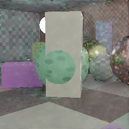
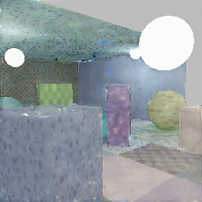
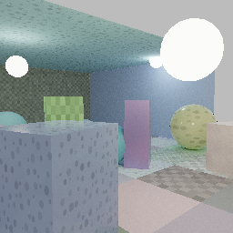
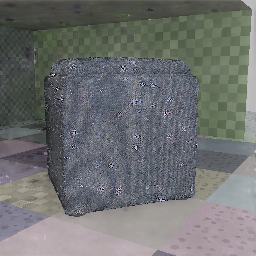
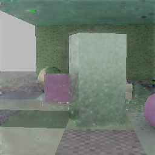
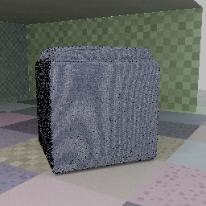

# ommatidia

[](https://github.com/kvark/ommatidia/actions/workflows/check.yml)

Neural reconstruction of sparse path-traced frames, in Rust on
[Meganeura](https://github.com/kvark/meganeura) and
[Blade](https://github.com/kvark/blade).

One model: a **recurrent, direct-radiance U-Net (v4)**. It reconstructs
diffuse illumination and specular radiance, then applies observed material albedo
and emission, learning history blending and a latent recurrent state. At 2x scale
it has 174,576 parameters and 1.63 GFLOP/frame at 128×128 → 256×256. Inputs include 1-spp
low-resolution radiance, motion/jitter and output-resolution primary surfaces.

The GPU-cursor training loop reaches **7.41 million valid pixel-gradients/s,
24.77× the earlier loop**, on the RX 7900 XT. This is training throughput, not
a quality claim; [measurement and accounting](docs/training-profile.md#phase-3-cursor-loop).

## Measured results

These retained pictures and numbers use the **pre-fix v3 decoder**, not today's
runtime or a trained v4 model. The checkpoint is unchanged; see the
[runtime archive and reproduction notes](docs/archive/README.md).
The [adopted v4 plan](PLAN.md) replaces the runtime; these archived results will
be replaced only after v4 quality evaluation. Implementation progress and
outstanding checks are in [the run ledger](docs/experiments.md).

Fresh-scene audit: **256 frames**, 1-spp 128×128 input → 256×256 output,
16-frame causal sequences, 4,096-spp references. The same model was fine-tuned
for 4,000 updates at this resolution. Development selected the final checkpoint
before the audit. Both checkpoints receive identical frames and run their own history.

| Audit | PSNR, previous → now ↑ | SSIM, previous → now ↑ | Temporal error ↓ |
|---|---|---|---|
| Procedural scenes | 28.18 → **28.65 dB** | 0.823 → 0.837 | −7.7% |
| Held-out object scenes | 28.91 → **29.60 dB** | 0.797 → 0.816 | −7.8% |

The comparison is against the previous **trained checkpoint**, not just the fixed
guide. PSNR improves on 246/256 frames; the worst regression is 0.26 dB.
The unchanged, previously published audit also improves: **28.24 → 28.67 dB**
(procedural) and **29.04 → 29.79 dB** (objects).

Mean energy bias on the fresh audit is now −0.40% / approximately 0%, down from
+1.34% / +2.58%. Specular noise, blotches and missing detail remain.
[Full metrics, protocol, hashes and limitations](docs/results/README.md).

Sequence 0, frame 7 in each set, chosen before evaluation. Native 256×256
outputs; identical display transform, no retouching.

| Previous checkpoint | Fine-tuned checkpoint | Reference |
|---|---|---|
|  |  |  |
|  |  |  |

Object assets: Amazon.com, [ABO / CC BY 4.0](docs/catalog.md). Authored objects
replace the extra primitives; measured visible coverage is 4.2–40.5% per audit
frame. Scene seeds and asset families are disjoint from training and development;
these are fresh scenes using the same four audit families as the previous report.

## Build and train

Rust 1.92+. Place `ommatidia` and `blade` in sibling directories.
Cargo pins Blade to `fbb4f28` and Meganeura to `ee3aea4`; only Blade has a local
sibling override. Keep Blade's shader directory at the same revision.
Naga also needs the tracked [workgroup-layout correction](patches/README.md);
the preparation command below installs it into the ignored build directory.

```sh
python3 scripts/prepare-naga.py
cargo +1.92.0 test --workspace --locked
cargo build --release --workspace
cargo run --release -p ommatidia-train --bin transport -- \
  --data data/train.omd --eval-data data/dev.omd --out runs/model \
  --steps 5000 --channels 16 --unroll 4 --batch 8 --crop 64 --lr 0.0003
```

[Architecture and runtime](docs/design.md) ·
[Data, metrics and reproduction](docs/evaluation.md) ·
[External asset capture](docs/catalog.md)

## Scope

This is a reconstruction research prototype, not demonstrated DLSS parity.
The training corpus is still small and synthetic; game traces, broad interiors,
and matched external-denoiser comparisons remain missing.

The old diffusion, kernel-selector, field/relighting, C ABI, trainers and result
galleries were removed. They remain at tag `archive/experiments-2026-09-25`
(`e0922c6`). There are no hidden
architecture switches or compatibility interpretations of their weights.
The retained runtime is `ommatidia::transport::native::Native`, config version 4.
It rejects v3 weights; use the archived executable to reproduce the gallery.

v4 passes 94 regular tests and ten GPU gates on both RADV and LavaPipe with
zero validation errors, including recurrent HDR/reset parity, f64 gradients,
production-size directional gradients, mean-gradient accumulation, GPU cursor
carry, optimizer/cursor resume and exact reload. Fresh LavaPipe captures
also pass the trainer/evaluator integration smoke. [Recorded runs](docs/experiments.md).
The pinned compiler correction addresses a reproduced Workgroup-array layout
failure, not all possible compiler bugs.
