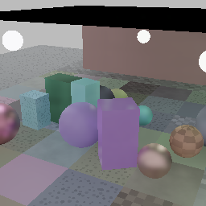
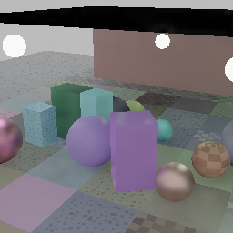
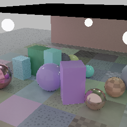

# Direct lobe residual — 2026-08-24

## Question

Can the model reconstruct clean diffuse illumination and specular radiance
directly, rather than predict which fixed filter should be trusted?

The offline model emitted independent sub-pixel RGB corrections over the fixed
diffuse and specular estimates. Exact output-resolution albedo and the existing
emissive estimate composed the final image. It used the high-sample lobe planes
Blade already records; no renderer or dataset-format change was needed.

The experiment added no Meganeura operation or shader. Its prediction mode,
CPU target assembly, and evaluator path were removed after the final gate.

## Protocol

- Training/iteration: seed 62000, 32 scenes with 16 projection-jittered 1-spp
  frames each, split by whole scene into 24 train and 8 validation scenes.
- Calibration: seed 70000, eight new scenes, used only to select the fixed
  correction share from 0.2 through 0.8.
- Audit: seed 71000, eight further scenes, not read until the share was fixed.
- Every target is an independent 16,384-spp, eight-bounce canonical render at
  256x256. Input is 128x128 and output is 2x.
- Conditioning uses 16-frame phase-lobe history. Evaluation reports linear
  PSNR, display-space SSIM, relMSE, detail retention, 16x16-output-block
  low-frequency PSNR, and motion-reprojected temporal error.

The two fresh reference sets each contain nine generated scenes because the
trainer always leaves one sequence outside validation. Blade's lobe-composition
audit passed before either set was scored. On the local integrated Radeon,
nine converged references took 15–16 minutes; their 144 matched sparse records
took about two seconds. Clean reference generation, not sparse capture, is the
corpus-scaling bottleneck.

## Capacity and calibration

| model | parameters | estimated 1080p arithmetic | seed-62000 PSNR | SSIM | LF PSNR |
|---|---:|---:|---:|---:|---:|
| fixed split estimator | 0 | deterministic filter | 31.10 dB | **0.9309** | 34.57 dB |
| direct lobes B8, full correction | 79,784 | 19.1 GFLOP | 31.28 dB | 0.9227 | 34.88 dB |
| direct lobes B16, full correction | 302,160 | 59.9 GFLOP | **31.42 dB** | 0.9227 | **35.10 dB** |

The larger model fits the target better, but both full corrections restore
residual variance along with useful structure. Calibration therefore selected
the strongest correction that still improved SSIM on the fresh seed-70000
set. B8 selected 0.5. B16 selected 0.7: 0.7 scored 31.88 dB / 0.9303 SSIM,
while 0.8 retained the same PSNR but fell to 0.9296 SSIM. This selection was
complete before seed 71000 was evaluated.

The share needs no inference option. Scaling the physical residual before its
standard deviation is measured changes the stored residual gain inversely, so
the normalized training target and weights are unchanged while the existing
assembly contract applies the calibrated correction.

## Untouched full-frame audit

The final score covers all 120 history-bearing frames: 8 scenes × 15 scored
frames, each evaluated as one full 256x256 crop.

| reconstruction | PSNR | SSIM | relMSE | worst relMSE | detail | LF PSNR |
|---|---:|---:|---:|---:|---:|---:|
| fixed split-lobe filter | 30.47 dB | **0.9132** | 0.05443 | 0.19 | 76% | 34.85 dB |
| B16 direct lobes, 0.7 correction | **30.61 dB** | 0.9097 | **0.04983** | **0.18** | **78%** | **35.01 dB** |

| temporal diagnostic | fixed split | direct lobes | gain |
|---|---:|---:|---:|
| reprojected delta MSE | 0.000421 | **0.000407** | +0.14 dB |
| low-frequency temporal delta MSE | 0.000117 | **0.000108** | +0.36 dB |
| nonzero-motion delta MSE | 0.000460 | **0.000445** | +0.14 dB |

| fixed split-lobe estimator | B16 direct-lobe probe | 16,384-spp reference |
|---|---|---|
|  |  |  |

The error and temporal gains generalize, but the SSIM loss does too. The image
shows a modest reduction in broad ceiling and wall variation, while important
canonical glossy structure remains absent. This does not meet the visual or
structural gate and does not justify tripling model arithmetic.

## Decision

Do not promote either direct-lobe model, and remove the experimental prediction
path. Direct lobe supervision is a better target than filter-scale selection:
it improves PSNR, low-frequency error, relative error, detail, and temporal
stability on independent scenes. But a model trained on 24 scenes does not
generalize structure well enough, and capacity amplifies that mismatch.

The next experiment is a data-scale study, not a larger backbone: add the two
fresh seed families and more lighting/geometry families to training, keep a
third family untouched, and repeat B8 before B16. Only a model that improves
SSIM and the visible full-frame result on that audit should earn a native
runtime contract.
