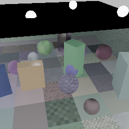
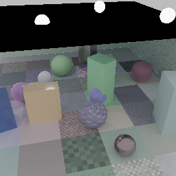

# Split-radiance temporal reconstruction, 2026-08-23

## Question

The phase-history comparison still showed broad low-frequency clouds and soft
glossy response. Was that a noisy reference, too little model capacity, or a
bad reconstruction contract?

## Controlled data

- 32 Blade scenes, seed 62000, 128x128 input to 256x256 output.
- Textures, gloss, canopy, and an 8x8 patched ground are enabled.
- Each sequence has sixteen independent 1-spp path-traced frames covering the
  exact 2x projection-jitter grid.
- The target is a separately captured 16,384-spp path trace. Training used an
  earlier 2,048-spp target during the first probe; all figures and final scores
  here use the clean target.
- The renderer stores total colour plus first-response diffuse illumination,
  specular radiance, and direct emissive radiance. Diffuse illumination is
  multiplied by exact output-resolution diffuse albedo only after filtering.

The split is an accounting identity, not a new estimator. Recomposition RMSE
was 0.000675 for the 1-spp input and 0.000909 for the copied high-resolution
reference, with 0.040% and 0.068% mean relative error respectively. The
remaining error is dominated by half-float radiance and 8-bit albedo storage.

Validation holds out four complete scene sequences. The full-frame score uses
60 non-reset frames, so every scene contributes fifteen temporal ages. PSNR and
relative MSE are measured in linear HDR; SSIM and detail retention use the
display transform; low-frequency PSNR measures 16x16 output-block averages.

## What changed

The original split guide made two incorrect assumptions:

1. Diffuse illumination was already demodulated, but its bilateral still
   rejected neighbours at diffuse-albedo changes. That prevented a textured
   coplanar surface from pooling illumination samples.
2. Every specular sample was treated as mirror-like. Ordinary rough dielectric
   reflection therefore retained raw Monte Carlo variance on walls.

The corrected estimator ignores albedo for demodulated diffuse illumination,
filters specular according to primary roughness, leaves direct emission sharp,
and restores exact high-resolution albedo. Five edge-aware 3x3 à-trous passes
at strides 1, 2, 4, 8, and 16 cover a 63x63 low-resolution footprint with 45
taps per texel. This was both better and cheaper in the CPU evaluator than
repeating dense 13x13 bilateral passes.

The temporal representation also retains each projection phase's total colour
and nine lobe values independently, alongside the accepted low-grid temporal
mean. No Meganeura operation or shader group was added.

## Results

Full-frame validation:

| reconstruction | PSNR | SSIM | relMSE | detail | LF PSNR |
|---|---:|---:|---:|---:|---:|
| bilinear | 21.00 dB | 0.5395 | 4.39336 | 179% | 29.64 dB |
| combined-colour HR guide | 28.11 dB | 0.8467 | 0.08272 | 54% | 32.60 dB |
| split-lobe à-trous | 29.87 dB | **0.9165** | 0.05551 | 71% | 34.17 dB |
| compact residual | **30.01 dB** | 0.9161 | **0.05058** | **74%** | **34.48 dB** |

At temporal frame fifteen the residual reaches 30.71 dB / 0.9255 SSIM and
35.89 dB low-frequency PSNR. The full comparison is checked into
`docs/temporal-low-frequency/`.

The fixed estimator accounts for nearly all the improvement. Its learned RGB
residual adds only 0.14 dB, and broad wall variation remains visible. This is
not release-quality ray reconstruction yet.

## Architecture controls

The following arms used the same held-out scenes and target:

| arm | parameters | 1080p arithmetic floor | result versus its base |
|---|---:|---:|---:|
| b8, 3-level U-Net | 78,920 | 18.2 GFLOP | +0.14 dB full-frame |
| b8, 4-level, 2 blocks | 419,528 | 30.2 GFLOP | -0.05 dB versus b8 at 1,000 steps on the dense-filter control |
| b8, 5-level + global bottleneck attention | 1,233,160 | 27.9 GFLOP | +0.03 dB on hard crops |

The attention arm used Meganeura's existing full-attention node; it required no
new backend code. It still failed the quality control and was removed. This
agrees with the earlier compute-matched shifted-window experiment: attention is
not automatically a better denoiser when the output parameterisation asks for
an unpredictable final-colour residual.

## Per-lobe scale oracle

The next target was gated before adding another model head. For every frame,
`lobe-scale-oracle` reconstructs the unfiltered diffuse and specular lobes plus
the result after each of the five existing à-trous passes. It selects one scale
per lobe and constant 8x8, 16x16, or 32x32 output block against independently
rendered clean lobe planes, then restores output-resolution albedo and direct
emission. The block constraint prevents selection from following individual
Monte Carlo samples.

This audit uses all 32 scenes, not the four-scene validation subset above: 480
non-reset frames against 32 independently captured 16,384-spp references.

| reconstruction | PSNR | SSIM | relMSE | detail | energy | LF PSNR |
|---|---:|---:|---:|---:|---:|---:|
| fixed split-lobe filter | 31.11 dB | 0.9349 | 0.08618 | 76.5% | 0.997 | 35.33 dB |
| lobe oracle, 8x8 blocks | **32.82 dB** | **0.9441** | 0.07375 | **80.2%** | 0.996 | **38.68 dB** |
| previous frame's 8x8 labels | 32.43 dB | 0.9429 | **0.04934** | **80.2%** | 0.997 | 37.79 dB |
| lobe oracle, 16x16 blocks | 32.39 dB | 0.9434 | 0.08020 | 78.6% | 0.996 | 37.71 dB |
| previous frame's 16x16 labels | 32.25 dB | 0.9433 | 0.05061 | 78.3% | 0.997 | 37.27 dB |

The 8x8 oracle is +1.71 dB overall and +3.35 dB on low-frequency error while
preserving energy and more reference detail. The selected scales are genuinely
spatial: the 8x8 diffuse histogram ranges from 26.4% unfiltered to 31.5% fully
filtered, and specular from 31.4% to 22.5%. Applying the preceding frame's
reference-derived labels retains most of the gain. That is evidence that the
target is temporally stable; it is not evidence of a deployable predictor,
because those labels still require the reference.

| fixed split-lobe filter | 8x8 lobe oracle | 16,384-spp reference |
|---|---|---|
|  |  |  |

The data and score can be reproduced without retained local state:

```sh
cargo run --release -p ommatidia-data -- \
  --out data/lobe-scale-reference.omd --samples 32 --lr 128x128 --scale 2 \
  --canonical-frames 4096 --canonical-bounces 8 --input-frames 1 \
  --canopy --ground-patches 8 --textures --gloss --split-radiance \
  --seed 62000 --hr-gbuffer

cargo run --release -p ommatidia-data -- \
  --out data/lobe-scale-input.omd --samples 32 --lr 128x128 --scale 2 \
  --canonical-bounces 8 --input-frames 1 --sequence-frames 16 \
  --canopy --ground-patches 8 --textures --gloss --projection-jitter \
  --split-radiance --seed 62000 --hr-gbuffer \
  --reference-from data/lobe-scale-reference.omd

cargo run --release -p ommatidia-train --bin lobe-scale-oracle -- \
  --data data/lobe-scale-input.omd \
  --reference-data data/lobe-scale-reference.omd --blocks 8,16,32
```

`--canonical-frames 4096` accumulates four paths per frame, hence 16,384 paths
per output pixel. The generator's optional `--device-id` is intentionally
absent: adapter selection is only needed when running this standalone tool and
is not part of Ommatidium's integration contract.

## Longer history control

Running the unchanged 16-frame weights on an otherwise identical 64-frame
sequence reached 31.45 dB / 0.9355 SSIM on frame 63. More independent samples
help, but visible low-frequency variation remained. A longer accumulation
window is therefore useful policy, not the architectural fix.

## Decision

Keep the renderer lobe contract and multiscale estimator. Do not keep the
failed transformer branch. The scale oracle clears the quality gate, so the
next learned target should predict a low-resolution mixture over the existing
filter scales per lobe before composition. It should be proven in the CPU
evaluator before adding a GPU contract or Meganeura operation. The current
native runtime rejects split-lobe checkpoints until those planes and the
multiscale reconstruction have a matching GPU pack/unpack path.
